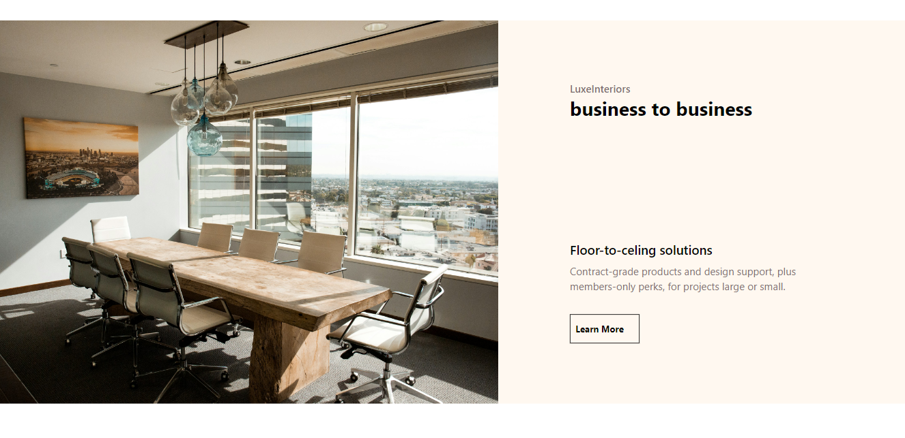
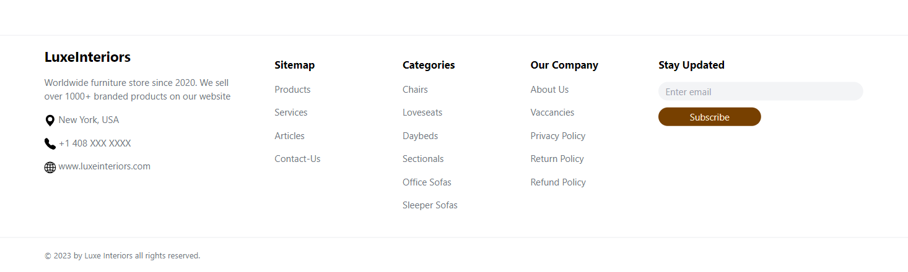

# LuxeInteriors - React E-commerce Website

LuxeInteriors is a modern, responsive, and fully-functional e-commerce website for purchasing furniture online.

## Technologies Used

- **React**: A JavaScript library for building user interfaces.
- **Context API**: A React feature for managing state globally.
- **React Hook Form**: A library for handling form validation and submission.
- **Tailwind CSS**: A utility-first CSS framework for rapidly building custom designs.
- **Git**: A version control system for tracking changes in the source code.
- **GitHub**: A platform for hosting and collaborating on Git repositories.

## Vite

This project uses Vite for a fast development environment with Hot Module Replacement (HMR). The following plugins are utilized:

- [@vitejs/plugin-react](https://github.com/vitejs/vite-plugin-react/blob/main/packages/plugin-react/README.md) uses [Babel](https://babeljs.io/) for Fast Refresh.
- [@vitejs/plugin-react-swc](https://github.com/vitejs/vite-plugin-react-swc) uses [SWC](https://swc.rs/) for Fast Refresh.

## Screenshots

### Login

Login PopUp window.

### Register

Register PopUp window.

### Home Page

Header along with the navigation bar

Categories section

Business-solutions section

Featured products

Footer

### Product Collection Page

One of the product collection page with filters.

### Product Details Page

One of the product details page with product description.

### Cart Page

Cart page showing selected products and total cart value.

## Different Pages

- **Home Page**: Displays the different categories of products along with some featured products.
- **Product Collection Page**: Browse and filter through all available products along with add to cart functionality.
- **Product Details Page**: View detailed information, select product quantity add products to the cart.
- **Cart Page**: Manage your selected products before checkout.

## Features

- **Product Collection Page**:

  - Browse through all available products.
  - Filter products based on categories.
  - Add products to cart directly form here.

- **Product Details Page**:

  - View detailed information about each product including images, descriptions, price, and specifications.
  - Select product options (e.g., size, color).
  - Select product quantity and add products to the cart.

- **Fully Functional Cart Page**:

  - Add, remove, and update products in the cart.
  - View price and quantity of items in the cart.
  - Apply coupons.
  - View the cart total.
  - Proceed to checkout.

- **Responsive Design**:
  - The entire website is mobile-friendly and adapts seamlessly to different screen sizes.
  - Optimized layout for desktop, tablet, and mobile devices.

## Project Structure

- `src/assets`: Contains images, icons, and other static resources.
- `src/Components`: Contains all the React components.
- `src/Contexts`: Contains the Context API files for global state management.
- `src/Pages`: Contains different pages of the website (Home, Cart, Product Collection, Product Details, etc).

## Installation

1. Clone the repository:

   - git clone https://github.com/singh1251/Luxe-Interiors
   - cd luxeinteriors

2. Install the dependencies:

   - npm install

3. Start the development server:

   - npm run dev
